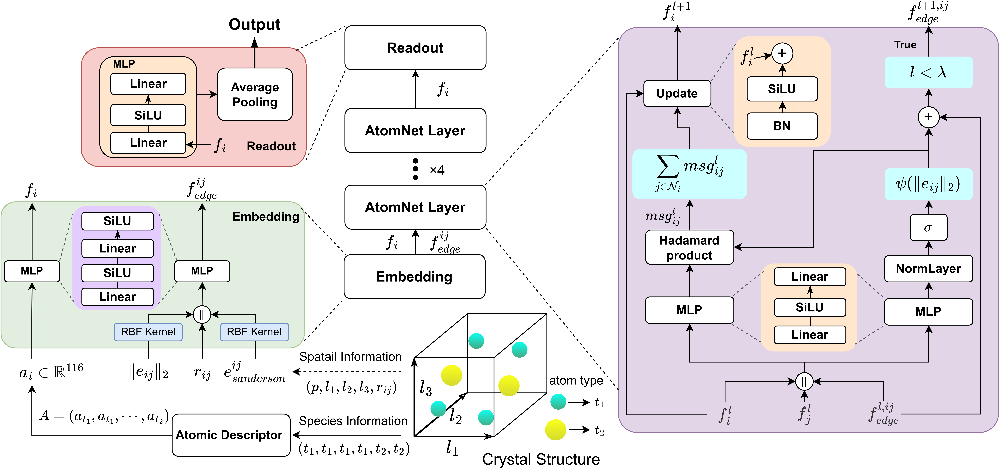
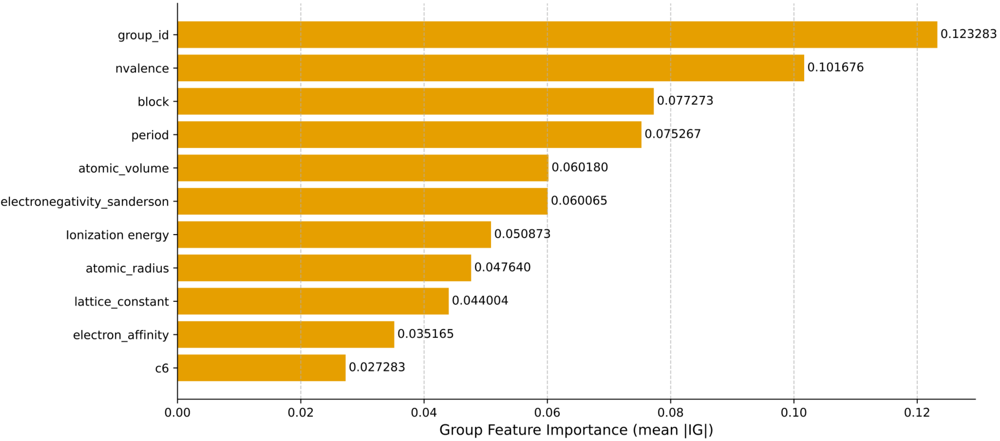
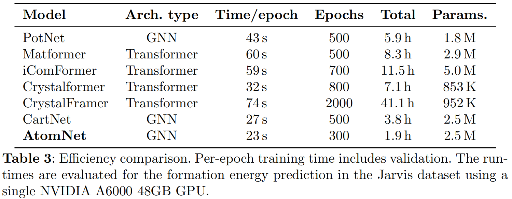

**[ <u>English</u> ]**  [[ 中文 ]](./README-cn.md)


# Physics-informed graph neural network representation learning for crystal property prediction

[](https://github.com/JieCoa/AtomNet/blob/main/LICENSE)

<h3 align="center">
  📃 <a href="https://www.nature.com/articles/s41524-026-02131-9" target="_blank">Paper</a>
</h3>


## AtomNet Architecture




## Environment Configuration

Use the `environment.yml` file in the repository to automatically install the environment:

```shell
# Create a Conda environment
conda env create -f environment.yml

# Activate the environment
conda activate 'atomnet'
```

**Manual installation of all environment packages**

> This is a record of the author's previous manual configuration on the server. Since it was done some time ago, some library installations might be missing. If you encounter missing libraries, please install them manually.

```shell
conda create -n atomnet python=3.11

conda install pytorch==2.1.2 torchvision==0.16.2 torchaudio==2.1.2 pytorch-cuda=12.1 -c nvidia -c pytorch

# Install torch_geometric dependencies
pip install torch-scatter -f https://pytorch-geometric.com/whl/torch-2.1.2+cu121.html
pip install torch-sparse -f https://pytorch-geometric.com/whl/torch-2.1.2+cu121.html
pip install torch-cluster -f https://pytorch-geometric.com/whl/torch-2.1.2+cu121.html
pip install torch-spline-conv -f https://pytorch-geometric.com/whl/torch-2.1.2+cu121.html

# Install torch_geometric
pip install torch-geometric

# Install jarvis package
pip install jarvis-tools

# Install remaining packages according to the code requirements
pip install roma
pip install pandas
pip install pytorch_lightning
pip install yacs
pip install wandb
pip install mendeleev==0.14.0
pip install captum


# Put this last: Incompatible with numpy 2.X+, switch back to 1.23.X+ but below 1.26.0
pip install numpy==1.26.0
```

## ⭐Datasets

Most of original datasets are automatically downloaded and processed by the code (📂`loader` → `loader.py`), except for the bulk and shear modulus that are publicly available at [Figshare](https://figshare.com/projects/Bulk_and_shear_datasets/165430). The bulk modulus and shear modulus datasets need to be manually downloaded and stored in the `dataset/megnet/` path. (Remember to change the file path to your own data storage path).


We also provide pre-processed datasets so you can directly train or infer your model. (In fact, the data preprocessing process only takes a few minutes.) 

❗ Place **the preprocessed datasets** in the `dataset/jarvis/preprocessed/` directory.

- :mag_right: [Jarvis DFT 3D 2021](https://doi.org/10.5281/zenodo.18993843)
- :mag_right: [Jarvis megnet (Materials Project 2018)](https://zenodo.org/records/20027439)


## ⭐Pre-trained models

For the five tasks in the Jarvis dataset, we provide corresponding [pre-trained models](https://zenodo.org/records/19045099) for inference.

❗ Unzip the compressed file and place the 📂`results` folder in the project root directory. 

- In other words, place the pre-trained models in the `results/` directory.


## Parameter Description 

> We designed a large number of command arguments in `main.py`, and we provide relevant descriptions for each parameter. We explain some important parameters in detail to help users better reproduce our experiments. For parameters not mentioned, we recommend keeping the default values.

- **atom_init**: Filename of the atom descriptors used to initialize node representations (suffix `.json` is auto-completed; all atom descriptor files are stored in 📂`dataset` → 📂`json`).

- **name**: Name of the current wandb experiment, which will be synchronized to the corresponding `wandb_project` to generate training records.

- **electronegativity_type**: Use **different RBF kernel functions** for Sanderson electronegativity edge features.

  ```shell
  electronegativity_type = newRBF, newRBF02, newRBF03, newRBF04, newRBF05
  ```

- **envelope_type**: We provide **Cubic Smooth** and **Simply** weight functions proposed in the main paper and supplementary files, i.e., `cubic` and `simply`.

- **disableUpdateEdge**: <u>Limit</u> or <u>stop</u> the update of edge features during the **message passing process**.

- **limitedUpdateEdge**: Run edge feature updates (residual connection) in the first `limitedUpdateEdge + 1` AtomNet Layers. Used in conjunction with `disableUpdateEdge`. Value range [0, 3], corresponding to AtomNet Layer count (default: 4).
  - In the Jarvis DFT 3D 2021 BandGap(MBJ) task, we found that when setting `limitedUpdateEdge==3` (if AtomNet_layer is 4 layers), the model's MAE metric is better. Alternatively, simply remove `--disableUpdateEdge` and `--limitedUpdateEdge` from the training script.

- **usePolynomial**: Default value `3`. In our experiments, besides using RBF (Radial Basis Function) for **feature derivation** on <u>interatomic distances</u>, we also applied classic **polynomial feature derivation methods** from Feature Engineering to extend "distance" features. Although not mentioned in the paper, experimental results proved the effectiveness of this method. (We recommend users to keep using the `--usePolynomial 3` parameter in all tasks to reproduce the paper results).

- **useElectronegativity**: Use Sanderson electronegativity as a new edge feature.

- **normalizedElectronegativity**: Used with `useElectronegativity` to normalize the electronegativity edge features.
  - When using this parameter, the `electronegativity_type` parameter value is automatically ignored (i.e., no dimension expansion on electronegativity edge features).

- **inference**: Use inference learning based on a pre-trained model.
  - Since initialization depends on specific architecture details of the pre-trained model, we recommend users use our provided example code and pre-trained models for testing. If you wish to use your own trained model, you need to first generate a pre-trained model using a training script, and then add `--inference` to that training script to perform inference.

- **ig**: Conduct interpretability experiments based on a pre-trained model and output visualization results.
  - Similar to the `inference` process, add the `--ig` parameter to the script used to get the pre-trained model, or use our provided example code and pre-trained models to achieve interpretability analysis results for atom descriptor features.

- **max_neighbours**: Experiments verified that while limiting the number of neighbors for the central atom can reduce model parameters and training time to some extent, the prediction results relying solely on the cutoff radius are superior in terms of final MAE metrics compared to models using both cutoff radius and maximum neighbor limits.


### Must Modify ❗

We highly recommend using [wandb](https://wandb.ai/site) to monitor model training. It's an excellent visualization website.

```python
parser.add_argument("--wandb_project", type=str, default="your_project_name", help="Wandb project name")
parser.add_argument("--wandb_entity", type=str, default="wandb_username", help="Name of the wandb entity")
```


## [Weights & Biases](https://wandb.ai/site)

Since the author used wandb for full process recording during model training, every user needs to change `wandb_project` and `wandb_entity` in `main.py` to their own project name and wandb username created on the wandb website before running the code, and configure the wandb API key in the running environment.


### Key Settings (2 Ways)

1. **Write in code**. e.g. `train.py`

   ```python
   import wandb 
   
   wandb.login(key=YOUR_API_KEY)
   ```

2. :+1: **Set in Command Line** (Suitable for temporary use, used by the author).

   ```shell
   export WANDB_API_KEY=YOUR_API_KEY
   ```


### Upload Training Records to wandb (Only for `offline` mode, execute after training ends)

Due to server access restrictions, we use `offline` mode during model training. Records need to be uploaded manually after training is complete.

```python
# wandb offline mode (use this if unable to connect to wandb server)
run = wandb.init(entity=cfg.wandb_entity, project=cfg.wandb_project, name=cfg.name, config=cfg, mode="offline")

# wandb online mode (remove 'mode="offline"')
run = wandb.init(entity=cfg.wandb_entity, project=cfg.wandb_project, name=cfg.name, config=cfg)
```

Upload commands:

1. Open terminal and activate the virtual environment (wandb package must be installed).
2. Enter the `wandb` log storage path (📂`wandb` folder in the project).
3. Execute `wandb sync "experiment_record_folder_name"` to upload records. (Ensure you can access the `wandb` website before uploading, otherwise it will time out).
4. If uploaded successfully, a `xxx.synced` file will be generated in the directory of `"experiment_record_folder_name"`.


## 🚀 Training

To reproduce the experiments in the paper, we provide optimal model training configuration code for each task (Paper results are the average of 8 results, obtained by training with 10 different seed parameters and removing one maximum and one minimum value).


### Jarvis DFT 3D 2021

We provide two methods for executing scripts for model training and inference:

1. Execute the script in the command-line terminal (example script shown below);

2. Execute `/scripts/linux_train_atomnet.py` for **Linux**, and `/scripts/train_atomnet_jarvis.py` for **Windows**.


#### Linux

> For `(` and `)` symbols, `\` is needed for escaping; this is the only difference from Windows commands.

##### 1. formation energy

```shell
python main.py --seed 206 --name dft_3D_formation_energy --dataset jarvis --figshare_target formation_energy_peratom --threads 10 --workers 5 --epochs 300 --atom_init atom_features\(116d\)_update01 --useElectronegativity --batch 128 --disableUpdateEdge --limitedUpdateEdge 2 --envelope_type simply --electronegativity_type newRBF
```

##### 2. bandgap(OPT)

```shell
python main.py --seed 448 --name dft_3D_opt_bandgap --dataset jarvis --figshare_target optb88vdw_bandgap --threads 10 --workers 5 --epochs 300 --atom_init atom_features\(116d\)_update01 --batch 128 --disableUpdateEdge --limitedUpdateEdge 2 --envelope_type cubic
```

##### 3. bandgap(MBJ)

```shell
python main.py --seed 296 --name dft_3D_mbj_bandgap --dataset jarvis --figshare_target mbj_bandgap --epochs 300 --atom_init atom_features\(116d\)_update01 --envelope_type simply
```

##### 4. ehull

```shell
python main.py --seed 510 --name dft_3D_ehull --dataset jarvis --figshare_target ehull --threads 10 --workers 5 --epochs 300 --atom_init atom_features\(116d\)_update01 --useElectronegativity --batch 128 --disableUpdateEdge --limitedUpdateEdge 2 --envelope_type cubic --electronegativity_type newRBF04
```

##### 5. total energy

```shell
python main.py --seed 306 --name dft_3D_total_energy --dataset jarvis --figshare_target optb88vdw_total_energy --threads 10 --workers 5 --epochs 300 --atom_init atom_features\(116d\)_update01 --useElectronegativity --batch 128 --disableUpdateEdge --limitedUpdateEdge 2 --envelope_type cubic --electronegativity_type newRBF
```


#### Windows

##### 1. formation energy

```shell
python main.py --seed 206 --name dft_3D_formation_energy --dataset jarvis --figshare_target formation_energy_peratom --threads 10 --workers 5 --epochs 300 --atom_init atom_features(116d)_update01 --useElectronegativity --batch 128 --disableUpdateEdge --limitedUpdateEdge 2 --envelope_type simply --electronegativity_type newRBF
```

##### 2. bandgap(OPT)

```shell
python main.py --seed 448 --name dft_3D_opt_bandgap --dataset jarvis --figshare_target optb88vdw_bandgap --threads 10 --workers 5 --epochs 300 --atom_init atom_features(116d)_update01 --batch 128 --disableUpdateEdge --limitedUpdateEdge 2 --envelope_type cubic
```

##### 3. bandgap(MBJ)

```shell
python main.py --seed 296 --name dft_3D_mbj_bandgap --dataset jarvis --figshare_target mbj_bandgap --epochs 300 --atom_init atom_features(116d)_update01 --envelope_type simply
```

##### 4. ehull

```shell
python main.py --seed 510 --name dft_3D_ehull --dataset jarvis --figshare_target ehull --threads 10 --workers 5 --epochs 300 --atom_init atom_features(116d)_update01 --useElectronegativity --batch 128 --disableUpdateEdge --limitedUpdateEdge 2 --envelope_type cubic --electronegativity_type newRBF04
```

##### 5. total energy

```shell
python main.py --seed 306 --name dft_3D_total_energy --dataset jarvis --figshare_target optb88vdw_total_energy --threads 10 --workers 5 --epochs 300 --atom_init atom_features(116d)_update01 --useElectronegativity --batch 128 --disableUpdateEdge --limitedUpdateEdge 2 --envelope_type cubic --electronegativity_type newRBF
```


### Materials Project

> Here we uniformly provide the basic script suitable for Linux. If you want to change to Windows, simply remove the `\` in the `--atom_init` part.

##### 1. e_form

```shell
python main.py --seed 235 --name megnet_formation_energy --dataset megnet --figshare_target e_form --threads 10 --workers 5 --epochs 300 --atom_init atom_features\(116d\)_update01 --useElectronegativity --batch 128 --disableUpdateEdge --limitedUpdateEdge 2 --envelope_type simply
```

##### 2. bandgap

```shell
python main.py --seed 331 --name megnet_bandgap --dataset megnet --threads 10 --workers 5 --epochs 300 --atom_init atom_features\(116d\)_update01 --batch 128 --disableUpdateEdge --limitedUpdateEdge 2 --envelope_type cubic
```

##### 3. bulk modulus

```shell
python main.py --seed 536 --name megnet_bulk_modulus --dataset megnet --figshare_target 'bulk modulus' --epochs 300 --atom_init atom_features\(116d\)_update01 --useElectronegativity --normalizedElectronegativity --batch 64 --disableUpdateEdge --limitedUpdateEdge 2 --envelope_type simply
```

##### 4. shear modulus

```shell
python main.py --seed 440 --name megnet_shear_modulus --dataset megnet --figshare_target 'shear modulus' --epochs 300 --atom_init atom_features\(116d\)_update01 --useElectronegativity --batch 64 --disableUpdateEdge --limitedUpdateEdge 2 --envelope_type cubic --electronegativity_type newRBF02
```


## Inference

### Data

> Ideally, the crystal structure used for inference should be distinct from the training dataset, and the data structure of the inference dataset should be consistent with the provided `inference_data.json`.
>
> - Similar to the model training dataset, we uniformly use the `from jarvis.core.atoms import Atoms` package to process inference data, therefore requiring the JSON data structure shown below.
>
> - "props" can be empty and will not be used during data processing.

#### inference_data.json

```json
// Jarvis DFT-3d 2021 - "jid": "JVASP-23213"
[
    {"atoms": {
        "lattice_mat": [
            [
                1.6374061181864787,
                4.6320620294223085,
                2.836071848582606
            ],
            [
                -0.0003656271176311,
                -0.0002587898763079,
                5.6727763751083975
            ],
            [
                4.9133178857659425,
                8.84592966e-08,
                -2.836705415419651
            ]
        ],
        "coords": [
            [
                3.2751799999999998,
                2.3159,
                2.8360700000000003
            ],
            [
                0.81852,
                2.3159,
                4.254425
            ],
            [
                2.45666,
                0.0,
                -1.418355
            ],
            [
                3.275365,
                2.31603,
                -0.000320000000000098
            ],
            [
                0.8187019541225831,
                0.5789094103158883,
                1.4180396205680705
            ],
            [
                5.731658045877419,
                4.052890589684114,
                4.254100379431928
            ],
            [
                2.564110246226763,
                3.4359435249916004,
                1.4178436178370966
            ],
            [
                2.456217182400851,
                3.3596525149154344,
                4.254296382471964
            ],
            [
                1.6914174084098796,
                1.1960121133920303,
                2.929622058350195
            ],
            [
                4.094142817599149,
                1.2721474850845667,
                1.417843617528035
            ],
            [
                1.691196226115134,
                1.1958564755409065,
                5.579347730486713
            ],
            [
                4.858942591590121,
                3.435787886607971,
                2.7425179416498056
            ],
            [
                3.986249753773237,
                1.195856475008399,
                4.254296382162902
            ],
            [
                4.859163773884865,
                3.4359435244590935,
                0.09279226951328705
            ]
        ],
        "elements": [
            "Fe",
            "Fe",
            "Fe",
            "Fe",
            "Fe",
            "Fe",
            "O",
            "O",
            "O",
            "O",
            "O",
            "O",
            "O",
            "O"
        ],
        "cartesian": true,
        "props": [
            "",
            "",
            "",
            "",
            "",
            "",
            "",
            "",
            "",
            "",
            "",
            "",
            "",
            ""
        ]
    }}
]
```


### Example script

> Here we uniformly provide the basic script suitable for Linux. If you want to change to Windows, simply remove the `\` in the `--atom_init` part.

#### Jarvis DFT 3D 2021

##### 1. formation energy

```shell
python main.py --seed 206 --name dft_3D_formation_energy --dataset jarvis --figshare_target formation_energy_peratom --threads 10 --workers 5 --epochs 300 --atom_init atom_features\(116d\)_update01 --useElectronegativity --batch 128 --disableUpdateEdge --limitedUpdateEdge 2 --envelope_type simply --electronegativity_type newRBF --inference
```

##### 2. bandgap(OPT)

```shell
python main.py --seed 448 --name dft_3D_opt_bandgap --dataset jarvis --figshare_target optb88vdw_bandgap --threads 10 --workers 5 --epochs 300 --atom_init atom_features\(116d\)_update01 --batch 128 --disableUpdateEdge --limitedUpdateEdge 2 --envelope_type cubic --inference
```

##### 3. bandgap(MBJ)

```shell
python main.py --seed 296 --name dft_3D_mbj_bandgap --dataset jarvis --figshare_target mbj_bandgap --epochs 300 --atom_init atom_features\(116d\)_update01 --envelope_type simply --inference
```

##### 4. ehull

```shell
python main.py --seed 510 --name dft_3D_ehull --dataset jarvis --figshare_target ehull --threads 10 --workers 5 --epochs 300 --atom_init atom_features\(116d\)_update01 --useElectronegativity --batch 128 --disableUpdateEdge --limitedUpdateEdge 2 --envelope_type cubic --electronegativity_type newRBF04 --inference
```

##### 5. total energy

```shell
python main.py --seed 306 --name dft_3D_total_energy --dataset jarvis --figshare_target optb88vdw_total_energy --threads 10 --workers 5 --epochs 300 --atom_init atom_features\(116d\)_update01 --useElectronegativity --batch 128 --disableUpdateEdge --limitedUpdateEdge 2 --envelope_type cubic --electronegativity_type newRBF --inference
```


#### Materials Project

##### 1. e_form

```shell
python main.py --seed 235 --name megnet_formation_energy --dataset megnet --figshare_target e_form --threads 10 --workers 5 --epochs 300 --atom_init atom_features\(116d\)_update01 --useElectronegativity --batch 128 --disableUpdateEdge --limitedUpdateEdge 2 --envelope_type simply --max_neighbours -1 --inference
```

##### 2. bandgap

```shell
python main.py --seed 331 --name megnet_bandgap --dataset megnet --threads 10 --workers 5 --epochs 300 --atom_init atom_features\(116d\)_update01 --batch 128 --disableUpdateEdge --limitedUpdateEdge 2 --envelope_type cubic --max_neighbours -1 --inference
```

##### 3. bulk modulus

```shell
python main.py --seed 536 --name megnet_bulk_modulus --dataset megnet --figshare_target 'bulk modulus' --epochs 300 --atom_init atom_features\(116d\)_update01 --useElectronegativity --normalizedElectronegativity --batch 64 --disableUpdateEdge --limitedUpdateEdge 2 --envelope_type simply --inference
```

##### 4. shear modulus

```shell
python main.py --seed 440 --name megnet_shear_modulus --dataset megnet --figshare_target 'shear modulus' --epochs 300 --atom_init atom_features\(116d\)_update01 --useElectronegativity --batch 64 --disableUpdateEdge --limitedUpdateEdge 2 --envelope_type cubic --electronegativity_type newRBF02 --inference
```


## 📊 Interpretability Results Visualization

> Interpretability experiments are based on pre-trained models. Here we uniformly provide the basic script suitable for Linux. If you want to change to Windows, simply remove the `\` in the `--atom_init` part.

#### Taking total energy as an example

Step 1: Train the model (skip if using a pre-trained model)

```shell
python main.py --seed 306 --name dft_3D_total_energy --dataset jarvis --figshare_target optb88vdw_total_energy --threads 10 --workers 5 --epochs 300 --atom_init atom_features\(116d\)_update01 --useElectronegativity --batch 128 --disableUpdateEdge --limitedUpdateEdge 2 --envelope_type cubic --electronegativity_type newRBF
```

Step 2: Conduct interpretability analysis experiment

> Simply add an `--ig` parameter to the training script base.

```shell
python main.py --seed 306 --name dft_3D_total_energy --dataset jarvis --figshare_target optb88vdw_total_energy --threads 10 --workers 5 --epochs 300 --atom_init atom_features\(116d\)_update01 --useElectronegativity --batch 128 --disableUpdateEdge --limitedUpdateEdge 2 --envelope_type cubic --electronegativity_type newRBF --ig
```

Step 3: Result Visualization

(1) Importance of different physical properties in atom descriptors

> `ig_framework.py` will visualize the importance of different atomic properties by plotting bar charts. You can find the saved images in the path 📂`/dataset/ig/img/`



(2) Stability analysis of IG values

> The table data will be output to the console.

| **n1** | **n2** | **spearman** | **kendall** | **MRC**      |
| ------ | ------ | ------------ | ----------- | ------------ |
| 20     | 32     | 1.0          | 1.0         | 7.364111e-05 |
| 20     | 64     | 1.0          | 1.0         | 6.908334e-05 |
| 20     | 128    | 1.0          | 1.0         | 6.897337e-05 |
| 32     | 64     | 1.0          | 1.0         | 6.235194e-06 |
| 32     | 128    | 1.0          | 1.0         | 6.304672e-06 |
| 64     | 128    | 1.0          | 1.0         | 3.072127e-07 |

## Model Efficiency



## Citation

Please cite [our paper](https://www.nature.com/articles/s41524-026-02131-9) if you find the code helpful or if you want to use the benchmark results. Thank you!

## Contact Us

If you have any questions or suggestions, please contact us at 202412854021@jmu.edu.cn (First Author) or kaihuang@jmu.edu.cn (Corresponding Author).


